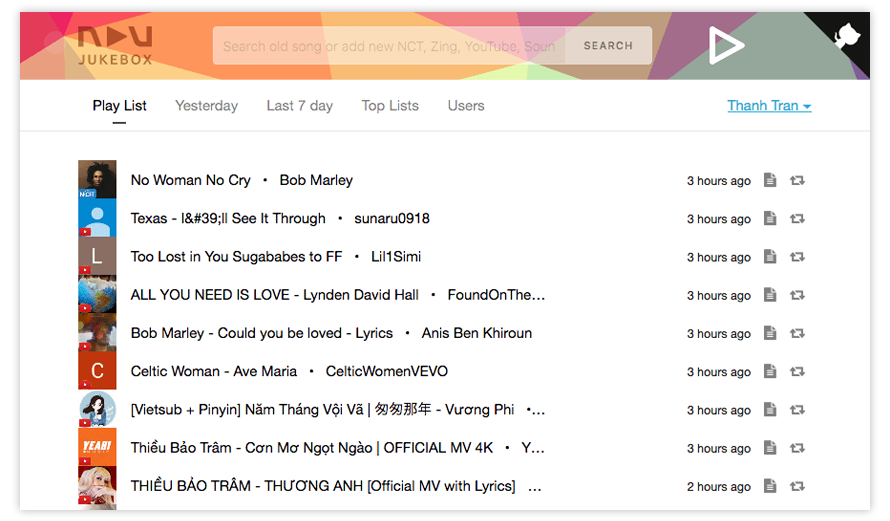

# NÂU JUKEBOX

A simple webapp which allows group of people (co-workers, friends gathering, house-mates) collectively suggest and play a continuously pending list of songs.

Currently users can book songs from well-known online music providers including: nhaccuatui.com, mp3.zing.com, soundcloud.com, and youtube.com. You can add more music providers by sending us a pull request.

The app is built with [Meteor](http://meteor.com/) which allows real-time interactions among active users.

## Features:

* Multiple rooms: different groups will be able to create different rooms with different playlist
* Login with Facebook and Google accounts
* Book songs from nhaccuatui.com, mp3.zing.com, soundcloud.com, and youtube.com
* Continuously play the media in the playlist regardless they come from different sources
* See today's playlist, yesterday's and last 7 days'
* See top songs of the week
* See current room's user list
* **Host** user role who is allowed to remove booked songs
* Simple and manual points system to reward users (Room member set own rules and host will be the referee)

## Roadmap:

See this project's [milestones](https://github.com/naustudio/nau-jukebox/milestones)

## Changelog:

See [CHANGELOG.md](CHANGELOG.md).

## Contributing:

See [CONTRIBUTING.md](CONTRIBUTING.md).

## Colophon:

* Meteor JS - http://meteor.com
* MongoDB - https://www.mongodb.com
* MediaElementJS - http://mediaelementjs.com
* ReactJS - https://reactjs.org
* Flux - https://github.com/facebook/flux
* Babel - https://babeljs.io
* Other Meteor packages: see .meteor/packages
* Other npm packages: see package.json

## Contributors

<!-- prettier-ignore -->
|  |  |  |  |  |
| ----------------- | ----------------------- | --- | --- | --- |
| [@trongthanh](https://github.com/trongthanh) | [@tampham47](https://github.com/tampham47) | [@tttt-conan](https://github.com/tttt-conan) | [@TDiNguyen](https://github.com/TDiNguyen) | [@leptco](https://github.com/leptco) |

---

© 2017 Nâu Studio and contributors. Licensed under MIT license.
